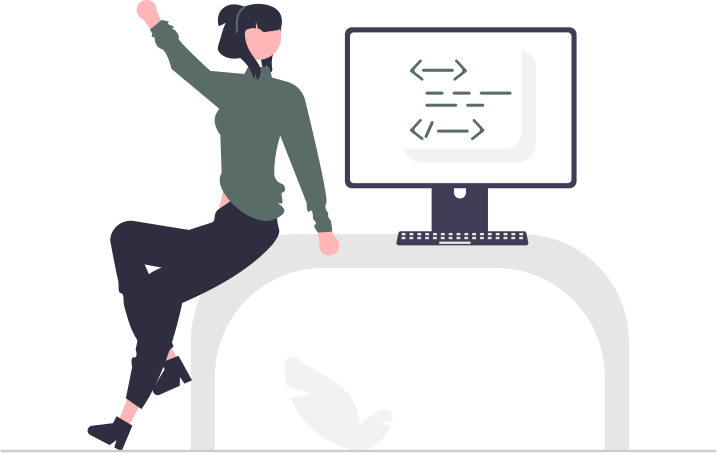

## Hi there 👋, I'm Moa, a future front-end developer from Sweden

I'm a front-end developer and web designer in production with a passion for functional, accessible, and well-tested UIs and Uxs. 

Outside of programming, my biggest issue in life is having too many hobbies. I find a new one every few months. Fitness, indoor gardening, and playing the violin are just a few. 

### Current projects

- 💻 Focusing on project practice with [@Frontend Mentor](https://www.frontendmentor.io/profile/moadavou)
- 🌱 I’m currently learning Javascript & Git
- 💬 Feel free to ask me about collaborations
- 😄 Pronouns: she/her

### Languages and tools
<code></code>
<code></code>

<!---
Icons: https://github.com/devicons/devicon
--->
